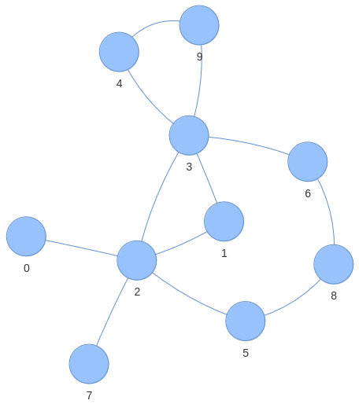

# Laboratorio 10
Gli obiettivi principali di questo laboratorio sono:
- staticmethod, classmethod e property
- eccezioni

Gli ultimi due esercizi riguardano l'esplorazione di grafi e ricorsione.

## Esercizio 1
Sviluppare la classe *Thermostat* rappresentate un termostato.
Il costruttore accetta come parametri la temperatura target da mantenere
e un valore booleano che esprime se l'utente vuole usare gradi Celsius o Fahrenheit.
La classe presenta due metodi statici (*staticmethod*)
che trasformano gradi Celsius in Fahrenheit e viceversa.

Sviluppare un metodo di classe (classmethod) che restituisce una nuova istanza della classe *Thermostat*,
copia di quella passata come parametro (questo è similare al costruttore di copia trovato in altri linguaggi).

Sia la temperatura target che il valore booleano devono essere ottenibili
e settabili tramite properties (usare gli appositi decoratori).
Se la temperatura impostata supera i 30 Celsius (o equivalente Fahrenheit)
limitarla a 30 Celsius (o equivalente Fahrenheit).

Per la temperatura ricordare che viene sia fornita che restituita nel formato (Celsius o Fahrenheit)
definito in quel momento. Inoltre, cambiare il formato non deve cambiare la temperatura target impostata.

**SUGGERIMENTO**: Per gestire i formati Celsius o Fahrenheit
è conveniente sceglierne uno solo per rappresentazione interna alla classe e poi fare le dovute conversioni
nei getter e setter (in questo caso definiti tramite properties).


## Esercizio 2
Scrivere un programma che permetta di gestire il noleggio di alcuni veicoli.
I veicoli sono caratterizzati da una targa e dalla categoria di veicolo.
Le patenti di guida sono caratterizzate da un nome e da un insieme di categorie veicolo che è possibile guidare.
Scrivere classe ```VehicleRental``` che permetta di aggiungere veicoli da noleggiare, e le patenti dei clienti.

La classe deve avere un metodo per noleggiare un veicolo data la targa e il nome sulla patente.
Il metodo deve lanciare eccezioni di tipo diverso per ciascuno dei seguenti eventi:
- la targa non è presente tra i veicoli registrati
- la patente del cliente non è stata registrata
- il veicolo è già stato noleggiato
- la patente di guida non è idonea per il veicolo che si vuole noleggiare

Tutte le eccezioni devono ereditare dall'eccezione ```RentalException```, ed essere strutturate in modo ereditario due in categorie, a seconda che riguardino un problema del veicolo e della patente.
Testare il metodo catturando le eccezioni in modo annidato, per esempio gestendo singolarmente i diversi problemi legati alla patente, e in modo generale quelli riguardanti il veicolo.

## Esercizio 3
Scrivere una classe per rappresentare il grafo **INDIRETTO** e **NON PESATO** in figura, utilizzando la rappresentazione che si preferisce.

Scrivere un metodo che permetta di trovare un percorso tra due nodi, di cui vengono forniti gli identificativi.
Per la ricerca dei percorsi, implementare sia la **Breadth First Search** che la **Depth First Search**, e permettere all'utente di selezionare l'algoritmo di ricerca tramite un parametro aggiuntivo.
Esempio:

```
Input: 1, 4
Output: [1, 3, 9 ,4]
```

Facendo alcune prove, che differenza si nota tra i risultati dei due algoritmi?




## Esercizio 4
Scrivere una funzione ricorsiva che crei un [quadrato magico](https://it.wikipedia.org/wiki/Quadrato_magico) di dimensioni specificate dal programmatore (*N x N*, *N >= 3*).
Un quadrato magico di dimensione *N x N* è un quadrato in cui sono disposti tutti i numeri da *1* a *N^2*, senza ripetizioni.
La somma dei numeri su ogni riga colonna o diagonale deve essere la stessa.
La ricorsione deve fermarsi quando si trova la prima configurazione corretta.

Scrivere una seconda versione che controlli, ogni volta che un numero viene aggiunto, se
la regola magica e stata violata. In caso affermativo non si prosegua con la ricerca per quella
configurazione parziale. Il controllo deve verificare che nessuna riga, colonna o diagonale
abbia una somma diversa dalla costante magica, nel caso in cui sia completa, o maggiore uguale
della stessa, nel caso in cui manchino dei valori. La constante magica è pari a n(n^2 + 1)/2.

Testare a partendo da *N=3*, qual è la dimensione massima del quadrato che si riesce a generare, in tempi ragionevoli, con la prima versione?
E con la seconda versione?

